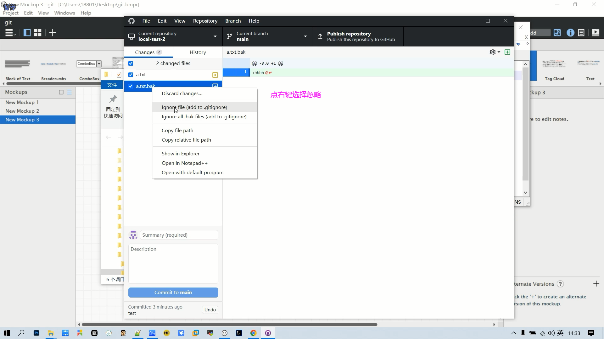

# Git

## 概述

### **软件配置管理** (Software Configuration Management)

软件配置管理(==SCM==)是指通过执行版本控制、变更控制的规程，以及使用合适的配置管理软件，来保证所有配置项的完整性和可跟踪性。配置管理是对工作成果的一种有效保护。

### 常用SCM软件

#### VSS (Visual Source Safe)

美国微软公司出品的版本控制系统，简称VSS   集中式版本控制系统

#### CVS（Concurrent Version System）

老牌的版本控制系统，它是基于客户端 /服务器的行为使得其可容纳多用户，构成网络也很方便,简称为CVS

#### SVN（Subversion）

开放源代码的版本控制系统，通过采用分支管理系统的高效管理，简而言之就是用于多个人共同开发同一个项目，实现共享资源，实现最终集中式的管理

#### PERFORCE

一款非常优秀的商业化版本管理工具,特别是对美术资源比较友好,更新速度快安全

#### Rational ClearCase

IBM Rational公司的旗舰产品之一，是全球领先的软件配置管理工具，它广泛地应用于众多的企业级软件工程实践之中，拥有众多的企业级用户

#### Git

开源的分布式版本控制系统，可以有效、高速地处理从很小到非常大的项目版本管理。也是Linus Torvalds为了帮助管理Linux内核开发而开发的一个开放源码的版本控制软件

### 版本控制软件的基本功能

#### 保存和管理文件

#### 提供客户端工具进行访问

#### 提供不同版本文档的比对功能

### 版本控制软件的分类

#### 集中式版本控制

#### 分布式版本控制

## Github Desktop

### 本地仓库操作

#### 本地仓库在Github Desktop中显示

#### 删除仓库

### 分支操作

#### 分支合并

分支合并可能会出现冲突，需要人工进行干预

### 文件操作

* 忽略操作

头行作用，告诉修改信息

### 标签操作

删除标签

### 远程仓库

#### github

#### gitee

## github

### 注册登录

### 仓库操作

#### 创建仓库

* 仓库创建后创建新的文件

#### 删除仓库

### 文件操作

#### 创建并提交新文件

#### 修改文件

### 分支管理

#### 创建新分支

#### 切换分支

## gitee

### 登录注册

### 仓库操作

#### 创建仓库

